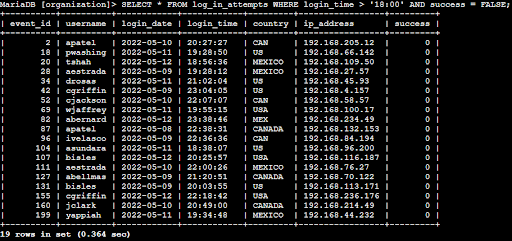
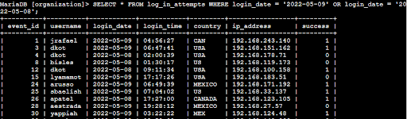
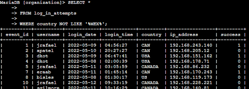
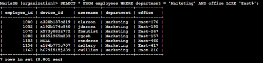
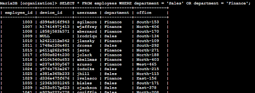
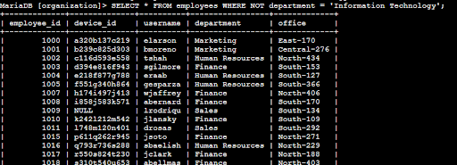

# SQL Filtering for Security Investigations

## Project Description

This project applies SQL filtering techniques to investigate security-related anomalies within an organization. The analysis focused on:

- Failed login attempts  
- Unusual access times  
- Department-based employee insights  

These queries aid internal security investigations and enhance the organization’s incident response capability.

---

## Use Cases & Queries

### 1. Retrieve After-Hours Failed Login Attempts

This query selects all failed login attempts (`success = FALSE`) that occurred after 6:00 PM.

```sql
SELECT * 
FROM log_in_attempts 
WHERE login_time > '18:00' 
AND success = FALSE;
```

**Purpose:** Identify unusual login attempts outside standard business hours.



---

### 2. Retrieve Login Attempts on Specific Dates

This query filters login attempts that occurred on May 8 or May 9, 2022.

```sql
SELECT * 
FROM log_in_attempts 
WHERE login_date = '2022-05-09'
OR login_date = '2022-05-08';
```

**Purpose:** Pinpoint potential breach attempts tied to particular incidents.



---

### 3. Retrieve Login Attempts Outside of Mexico

This query filters out any login attempts originating from Mexico-related entries.

```sql
SELECT * 
FROM log_in_attempts 
WHERE country NOT LIKE '%MEX%';
```

**Purpose:** Identify foreign access potentially indicating unauthorized behavior.



---

### 4. Retrieve Employees in Marketing (East Building)

This query lists Marketing department employees located in offices that start with "East".

```sql
SELECT * 
FROM employees 
WHERE department = 'Marketing' 
  AND office_location LIKE 'East%';
```

**Purpose:** Focus location-specific investigations or updates within Marketing.



---

### 5. Retrieve Employees in Finance or Sales

This query returns employees from either the Finance or Sales departments.

```sql
SELECT * 
FROM employees 
WHERE department = 'Sales' OR department = 'Finance';
```

**Purpose:** Segment departments for proactive security updates.



---

### 6. Retrieve All Employees Not in IT

This query lists all employees who are not in the Information Technology department.

```sql
SELECT * 
FROM employees 
WHERE NOT department = 'Information Technology';
```

**Purpose:** Determine which teams still need updates (excluding IT).



---

## Summary

Through structured SQL filtering, this investigation uncovered:

- Login anomalies outside regular work hours  
- Suspicious foreign access attempts  
- Department-level user insights for targeted security actions  

These results help reinforce cybersecurity protocols and better prepare for incident detection and response.

---

## Tools Used

- SQL (PostgreSQL / MySQL)  
- Internal login & employee databases  
- Manual analysis and query optimization

---

## Project Structure

```
/SQL-Security-Project
├── README.md
└── Screenshots/
    ├── 1.png
    ├── 2.png
    ├── 3.png
    ├── 4.png
    └── 5.png
```
